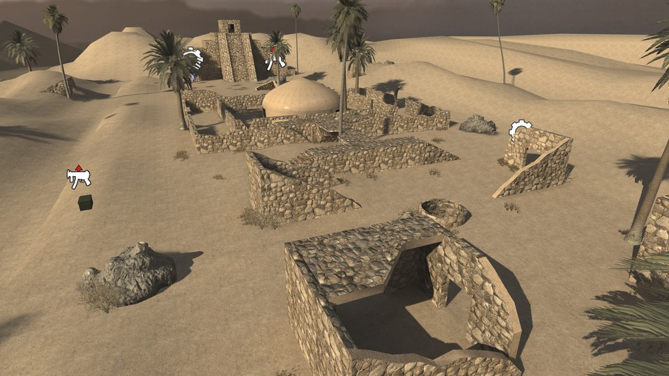

# Ancient


 - **name**: mp_ancient_final
 - **author**: markFreak
 - **email**: 
 - **web**: 

**Works\***: Yes
 
\* *'Works' here just means it passed my basic checks.  It does not mean it doesn't have bugs or is a good map; just that it appears to function as a RotU map.*

**Blacklisted\***: False
 
\* *'Blacklisted' means the map is, or will be after I exhaust efforts to fix it, blacklisted by RotU, and the mod will refuse to load the map. This helps minimize server crashes, and people trying unsuitable maps.*

## Notes


## Tested Version

These test results apply to the files with the MD5 hashes below. There may be multiple versions of map out there
with the same name but different data.

```
d8e258834128689ded06dd450330d749 mp_ancient_final.ff
286e775bc59ba81bd4d5fa6dd3b5fa3a mp_ancient_final_load.ff
39c81df4a89132aae05aadf112b3b142 mp_ancient_final.iwd
```

## Test Results

 - **RotU git revision**: 4ebb2d7
 - **test timestamp**: 2026-05-13 19:19:51 CDT (UTC-5)
 - **platform**: Linux Kubuntu 25.10 | CoD4 1.7 original 1080p | Wine v.10.0, @ 192 DPI | AMD Radeon 680M 4GiB, 4K Display
 - **map started**: True
 - **player spawned**: True
 - **zombie spawned & stalked player**: True
 - **waypoint validity**: Valid
 - **weapon shops**: 3
 - **equipment shops**: 3
 - **waypoint count**: 430
 - **waypoints type**: external
 - **compile error count**: 0
 - **runtime error count**: 0
 - **overall success**: True