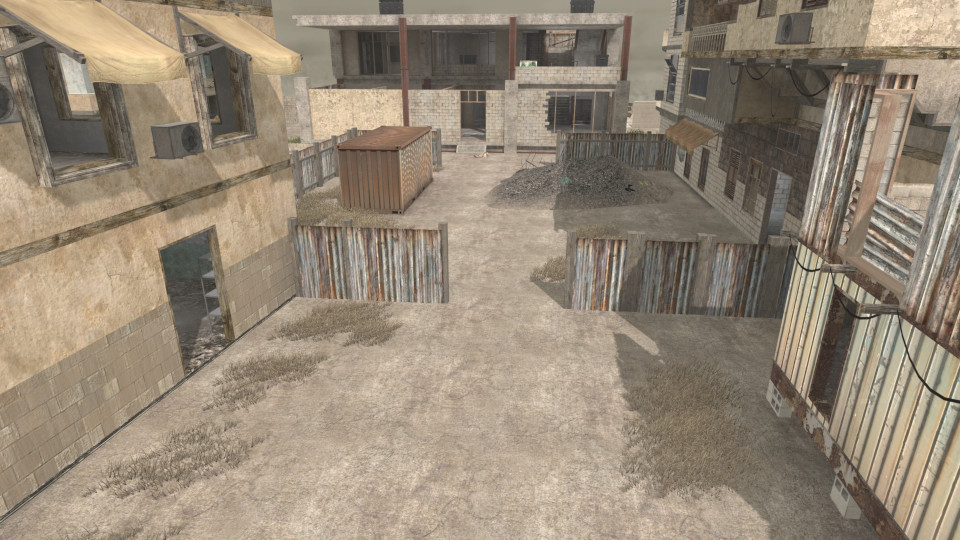

# Backlot Large


 - **name**: mp_bsf_backlot
 - **author**: 
 - **email**: B.S.F. Clan
 - **web**: 

**Works\***: No
 
\* *'Works' here just means it passed my basic checks.  It does not mean it doesn't have bugs or is a good map; just that it appears to function as a RotU map.*

**Blacklisted\***: True
 
\* *'Blacklisted' means the map is, or will be after I exhaust efforts to fix it, blacklisted by RotU, and the mod will refuse to load the map. This helps minimize server crashes, and people trying unsuitable maps.*

## Notes


## Tested Version

These test results apply to the files with the MD5 hashes below. There may be multiple versions of map out there
with the same name but different data.

```
9510e4227583eba6172a2df262acfd70 mp_bsf_backlot.ff
6b414cb72732665f1f2900536352aadf mp_bsf_backlot_load.ff
d5f69d2b8751364e140de70f5e826bc3 mp_bsf_backlot.iwd
```

## Test Results

 - **RotU git revision**: 29f938e
 - **test timestamp**: 2026-04-23 02:43:34 CDT (UTC-5)
 - **platform**: Linux Kubuntu 25.10 | CoD4 1.7 original 1080p | Wine v.10.0, @ 192 DPI | AMD Radeon 680M 4GiB, 4K Display
 - **map started**: False
 - **player spawned**: False
 - **zombie spawned & stalked player**: False
 - **waypoint validity**: 
 - **weapon shops**: 0
 - **equipment shops**: 0
 - **waypoint count**: 0
 - **waypoints type**: 
 - **compile error count**: 1
 - **runtime error count**: 0
 - **overall success**: False