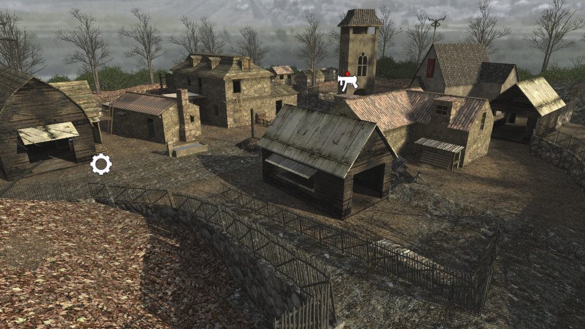

# Resident Evil Village


 - **name**: mp_surv_RE4village
 - **author**: Efraxskills
 - **email**: 
 - **web**: http://www.moddb.com/members/efraxskills

**Works\***: Yes
 
\* *'Works' here just means it passed my basic checks.  It does not mean it doesn't have bugs or is a good map; just that it appears to function as a RotU map.*

**Blacklisted\***: False
 
\* *'Blacklisted' means the map is, or will be after I exhaust efforts to fix it, blacklisted by RotU, and the mod will refuse to load the map. This helps minimize server crashes, and people trying unsuitable maps.*

## Notes

Ladders are broken.  They are solid, so likely missing the proper ladder material. Look for another version of map.

## Tested Version

These test results apply to the files with the MD5 hashes below. There may be multiple versions of map out there
with the same name but different data.

```
88fe4b623583b1c589ee65658098eae3 mp_surv_RE4village.ff
b1da26359c20bc7f4e44f4ced028e463 mp_surv_RE4village_load.ff
52b0d8321775842ef67fe83d1b38ba11 mp_surv_RE4village.iwd
```

## Test Results

 - **RotU git revision**: 2c94a3e
 - **test timestamp**: 2026-05-14 23:21:11 CDT (UTC-5)
 - **platform**: Linux Kubuntu 25.10 | CoD4 1.7 original 1080p | Wine v.10.0, @ 192 DPI | AMD Radeon 680M 4GiB, 4K Display
 - **map started**: True
 - **player spawned**: True
 - **zombie spawned & stalked player**: True
 - **waypoint validity**: Valid
 - **weapon shops**: 1
 - **equipment shops**: 1
 - **waypoint count**: 88
 - **waypoints type**: internal
 - **compile error count**: 0
 - **runtime error count**: 18281
 - **overall success**: True