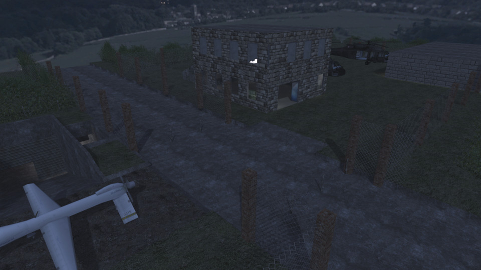

# Area 69


 - **name**: mp_surv_area_69_v1
 - **author**: 
 - **email**: 
 - **web**: 

**Works\***: Yes
 
\* *'Works' here just means it passed my basic checks.  It does not mean it doesn't have bugs or is a good map; just that it appears to function as a RotU map.*

**Blacklisted\***: False
 
\* *'Blacklisted' means the map is, or will be after I exhaust efforts to fix it, blacklisted by RotU, and the mod will refuse to load the map. This helps minimize server crashes, and people trying unsuitable maps.*

## Notes


## Tested Version

These test results apply to the files with the MD5 hashes below. There may be multiple versions of map out there
with the same name but different data.

```
347d8f1fec2695f8ee94e5e64b7a2f4d mp_surv_area_69_v1.ff
c78d9a739799446b1035282de5ccee3b mp_surv_area_69_v1_load.ff
None
```

## Test Results

 - **RotU git revision**: 63181be
 - **test timestamp**: 2026-04-12 03:19:54 CDT (UTC-5)
 - **platform**: Linux Kubuntu 25.10 | CoD4 1.7 original 1080p | Wine v.10.0, @ 192 DPI | AMD Radeon 680M 4GiB, 4K Display
 - **map started**: True
 - **player spawned**: True
 - **zombie spawned & stalked player**: True
 - **waypoint validity**: 
 - **weapon shops**: 2
 - **equipment shops**: 2
 - **waypoint count**: 0
 - **waypoints type**: None
 - **compile error count**: 0
 - **runtime error count**: 0
 - **overall success**: True