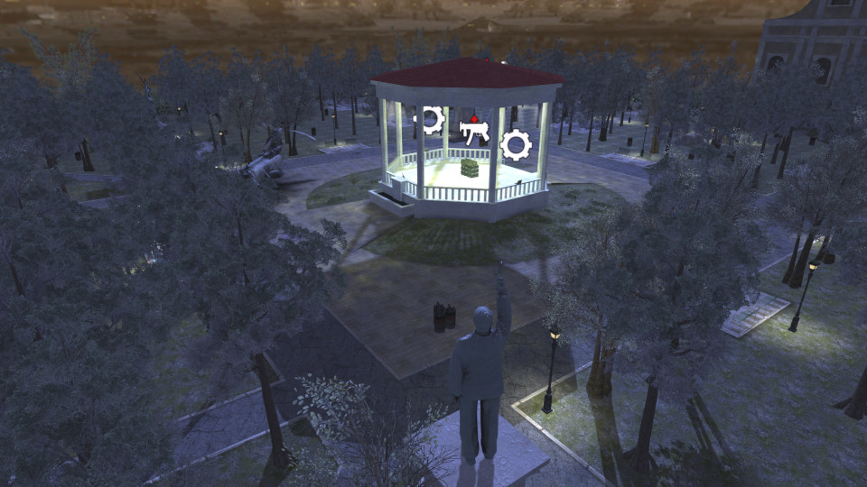

# Bjelovar

Based on City Park in Bjelovar, Croatia.

 - **name**: mp_surv_bjelovar
 - **author**: jerkan
 - **email**: jerkan@net.hr
 - **web**: https://jerkanmaps.weebly.com/rotu-maps.html

**Works\***: Yes
 
\* *'Works' here just means it passed my basic checks.  It does not mean it doesn't have bugs or is a good map; just that it appears to function as a RotU map.*

**Blacklisted\***: False
 
\* *'Blacklisted' means the map is, or will be after I exhaust efforts to fix it, blacklisted by RotU, and the mod will refuse to load the map. This helps minimize server crashes, and people trying unsuitable maps.*

## Notes


## Tested Version

These test results apply to the files with the MD5 hashes below. There may be multiple versions of map out there
with the same name but different data.

```
40fc27f22cf91b40d77af42ac559b386 mp_surv_bjelovar.ff
13c736f136fa73d8cf5d8a1f82c3d9f8 mp_surv_bjelovar_load.ff
89fac9a44c79898c4be31f2b37a24b4c mp_surv_bjelovar.iwd
```

## Test Results

 - **RotU git revision**: 63181be
 - **test timestamp**: 2026-04-12 03:23:34 CDT (UTC-5)
 - **platform**: Linux Kubuntu 25.10 | CoD4 1.7 original 1080p | Wine v.10.0, @ 192 DPI | AMD Radeon 680M 4GiB, 4K Display
 - **map started**: True
 - **player spawned**: True
 - **zombie spawned & stalked player**: True
 - **waypoint validity**: Valid
 - **weapon shops**: 5
 - **equipment shops**: 7
 - **waypoint count**: 814
 - **waypoints type**: internal
 - **compile error count**: 0
 - **runtime error count**: 0
 - **overall success**: True