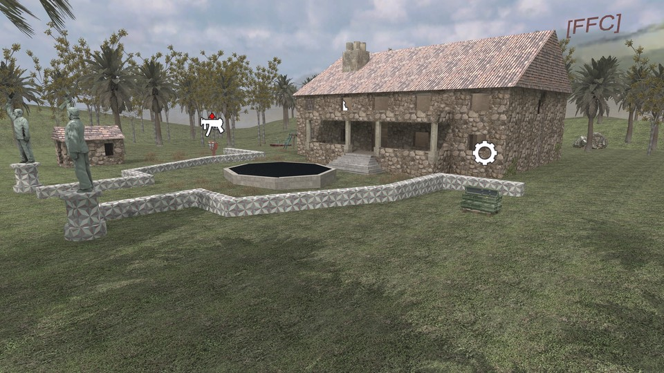

# Parkorman


 - **name**: mp_surv_ffc_parkorman
 - **author**: [ffc]Day1
 - **email**: 
 - **web**: 

**Works\***: Yes
 
\* *'Works' here just means it passed my basic checks.  It does not mean it doesn't have bugs or is a good map; just that it appears to function as a RotU map.*

**Blacklisted\***: False
 
\* *'Blacklisted' means the map is, or will be after I exhaust efforts to fix it, blacklisted by RotU, and the mod will refuse to load the map. This helps minimize server crashes, and people trying unsuitable maps.*

## Notes

Runtime errors.  Barricade issue. undefined is not a field object: (file 'maps/mp/_umi.gsc', line 1790)
ent.parts[j].startPosition = ent.parts[j].origin;

## Tested Version

These test results apply to the files with the MD5 hashes below. There may be multiple versions of map out there
with the same name but different data.

```
2dd774d98bee0c15710ae3271fa19014 mp_surv_ffc_parkorman.ff
d8e09089478c162fb6bc5479dec9f127 mp_surv_ffc_parkorman_load.ff
4e0319e835a7d214b87e19a812f7c00a mp_surv_ffc_parkorman.iwd
```

## Test Results

 - **RotU git revision**: 2f3c794
 - **test timestamp**: 2026-04-21 00:22:05 CDT (UTC-5)
 - **platform**: Linux Kubuntu 25.10 | CoD4 1.7 original 1080p | Wine v.10.0, @ 192 DPI | AMD Radeon 680M 4GiB, 4K Display
 - **map started**: True
 - **player spawned**: True
 - **zombie spawned & stalked player**: True
 - **waypoint validity**: Valid
 - **weapon shops**: 3
 - **equipment shops**: 3
 - **waypoint count**: 135
 - **waypoints type**: internal
 - **compile error count**: 0
 - **runtime error count**: 0
 - **overall success**: True