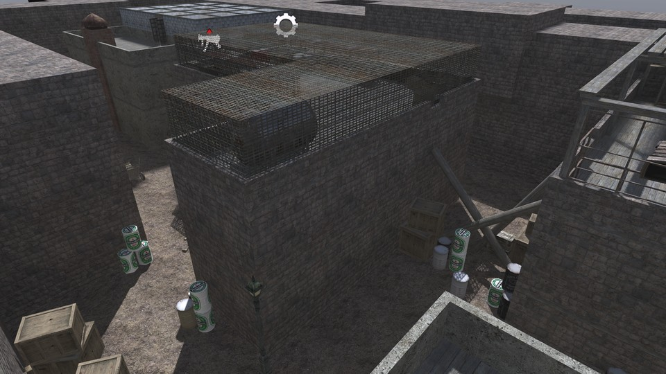

# Loft

Will you survive? Maybe. Stick to the high ground and stay safe in the loft, but remember you need to come down sooner or later.

 - **name**: mp_surv_loft
 - **author**: Odilasa
 - **email**: 
 - **web**: 

**Works\***: Yes
 
\* *'Works' here just means it passed my basic checks.  It does not mean it doesn't have bugs or is a good map; just that it appears to function as a RotU map.*

**Blacklisted\***: False
 
\* *'Blacklisted' means the map is, or will be after I exhaust efforts to fix it, blacklisted by RotU, and the mod will refuse to load the map. This helps minimize server crashes, and people trying unsuitable maps.*

## Notes

Reportedly too buggy

## Tested Version

These test results apply to the files with the MD5 hashes below. There may be multiple versions of map out there
with the same name but different data.

```
9885e5e1b9cdcf2906c720c94519b5f7 mp_surv_loft.ff
d78b9360f4ac2624fafcde523b065ecd mp_surv_loft_load.ff
None
```

## Test Results

 - **RotU git revision**: 63181be
 - **test timestamp**: 2026-04-12 11:29:53 CDT (UTC-5)
 - **platform**: Linux Kubuntu 25.10 | CoD4 1.7 original 1080p | Wine v.10.0, @ 192 DPI | AMD Radeon 680M 4GiB, 4K Display
 - **map started**: True
 - **player spawned**: True
 - **zombie spawned & stalked player**: True
 - **waypoint validity**: Valid
 - **weapon shops**: 1
 - **equipment shops**: 2
 - **waypoint count**: 101
 - **waypoints type**: internal
 - **compile error count**: 0
 - **runtime error count**: 0
 - **overall success**: True