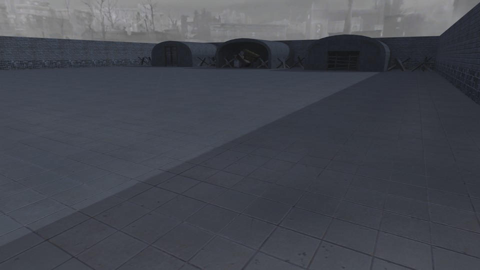

# Official Test Map

Official Test Map for Reign of the Undead courtesy of Jerkan. A small, walled plaza with equipment hangers.

 - **name**: mp_surv_testmap
 - **author**: jerkan
 - **email**: jerkan@net.hr
 - **web**: https://jerkanmaps.weebly.com/rotu-maps.html

**Works\***: Yes
 
\* *'Works' here just means it passed my basic checks.  It does not mean it doesn't have bugs or is a good map; just that it appears to function as a RotU map.*

**Blacklisted\***: False
 
\* *'Blacklisted' means the map is, or will be after I exhaust efforts to fix it, blacklisted by RotU, and the mod will refuse to load the map. This helps minimize server crashes, and people trying unsuitable maps.*

## Notes

None.

## Tested Version

These test results apply to the files with the MD5 hashes below. There may be multiple versions of map out there
with the same name but different data.

```
1832cd3587f416b04796ee2d9c103cc9 mp_surv_testmap.ff
f86d040ac34babc6a3af5c952492c9c2 mp_surv_testmap_load.ff
f0e4e1fee4bce9692f22fdae4008b8a5 mp_surv_testmap.iwd
```

## Test Results

 - **RotU git revision**: 4ebb2d7
 - **test timestamp**: 2026-05-13 19:19:02 CDT (UTC-5)
 - **platform**: Linux Kubuntu 25.10 | CoD4 1.7 original 1080p | Wine v.10.0, @ 192 DPI | AMD Radeon 680M 4GiB, 4K Display
 - **map started**: True
 - **player spawned**: True
 - **zombie spawned & stalked player**: True
 - **waypoint validity**: Valid
 - **weapon shops**: 1
 - **equipment shops**: 1
 - **waypoint count**: 60
 - **waypoints type**: internal
 - **compile error count**: 0
 - **runtime error count**: 0
 - **overall success**: True