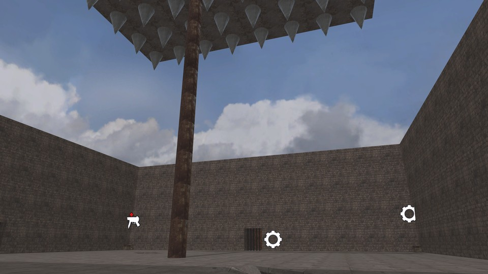

# Trap

Trapped inside a building with high walls. Above your head is a giant crusher supported by a pillar. Zombies will attack you from every side. The zombies are smart enough to attack the pillar in an attempt to crush you all. Your objective is to protect the pillar from the zombies and repair it if necessary. Don't forget: the crusher isn't there for decoration!

 - **name**: mp_surv_trap
 - **author**: Sphere87
 - **email**: 
 - **web**: 

**Works\***: Yes
 
\* *'Works' here just means it passed my basic checks.  It does not mean it doesn't have bugs or is a good map; just that it appears to function as a RotU map.*

**Blacklisted\***: False
 
\* *'Blacklisted' means the map is, or will be after I exhaust efforts to fix it, blacklisted by RotU, and the mod will refuse to load the map. This helps minimize server crashes, and people trying unsuitable maps.*

## Notes


## Tested Version

These test results apply to the files with the MD5 hashes below. There may be multiple versions of map out there
with the same name but different data.

```
7f2672391cc5488867c5ce14910003a8 mp_surv_trap.ff
324131d31dd56a46e810fb0727adcddd mp_surv_trap_load.ff
a61c67b052dc0e89a0764ca2d278d744 mp_surv_trap.iwd
```

## Test Results

 - **RotU git revision**: 63181be
 - **test timestamp**: 2026-04-12 12:51:12 CDT (UTC-5)
 - **platform**: Linux Kubuntu 25.10 | CoD4 1.7 original 1080p | Wine v.10.0, @ 192 DPI | AMD Radeon 680M 4GiB, 4K Display
 - **map started**: True
 - **player spawned**: True
 - **zombie spawned & stalked player**: True
 - **waypoint validity**: Valid
 - **weapon shops**: 2
 - **equipment shops**: 3
 - **waypoint count**: 173
 - **waypoints type**: internal
 - **compile error count**: 0
 - **runtime error count**: 0
 - **overall success**: True