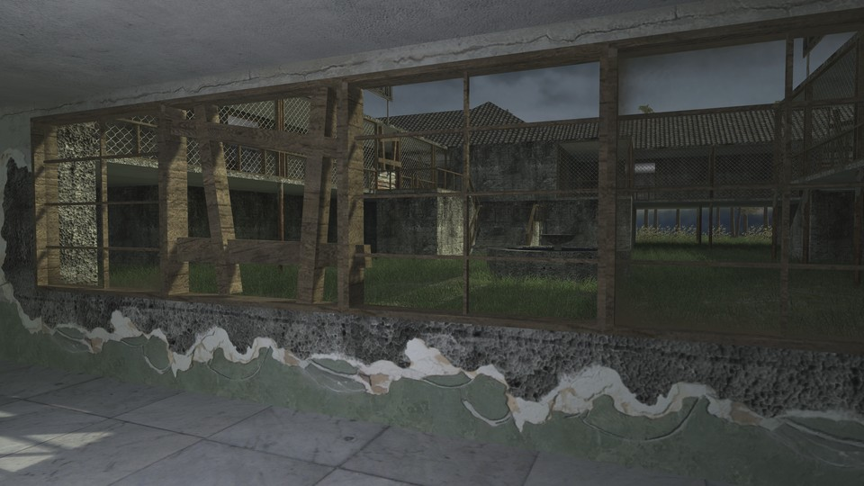

# Verrueckt

German word verrückt translates primarily to crazy, mad, or insane in English.

 - **name**: mp_surv_verrueckt
 - **author**: [RSD]Andy
 - **email**: 
 - **web**: https://www.rsd-clan.de

**Works\***: Yes
 
\* *'Works' here just means it passed my basic checks.  It does not mean it doesn't have bugs or is a good map; just that it appears to function as a RotU map.*

**Blacklisted\***: False
 
\* *'Blacklisted' means the map is, or will be after I exhaust efforts to fix it, blacklisted by RotU, and the mod will refuse to load the map. This helps minimize server crashes, and people trying unsuitable maps.*

## Notes

old note: buggy with zombie spawning, so do not use

## Tested Version

These test results apply to the files with the MD5 hashes below. There may be multiple versions of map out there
with the same name but different data.

```
5186fccba0cdfc218e2f1512e723aad3 mp_surv_verrueckt.ff
3874cb51711ff78e1ec175defdf8de39 mp_surv_verrueckt_load.ff
3a621a1a2a6b043032794f7a7bcc5f54 mp_surv_verrueckt.iwd
```

## Test Results

 - **RotU git revision**: 63181be
 - **test timestamp**: 2026-04-12 13:08:45 CDT (UTC-5)
 - **platform**: Linux Kubuntu 25.10 | CoD4 1.7 original 1080p | Wine v.10.0, @ 192 DPI | AMD Radeon 680M 4GiB, 4K Display
 - **map started**: True
 - **player spawned**: True
 - **zombie spawned & stalked player**: True
 - **waypoint validity**: Valid
 - **weapon shops**: 3
 - **equipment shops**: 3
 - **waypoint count**: 102
 - **waypoints type**: internal
 - **compile error count**: 0
 - **runtime error count**: 0
 - **overall success**: True