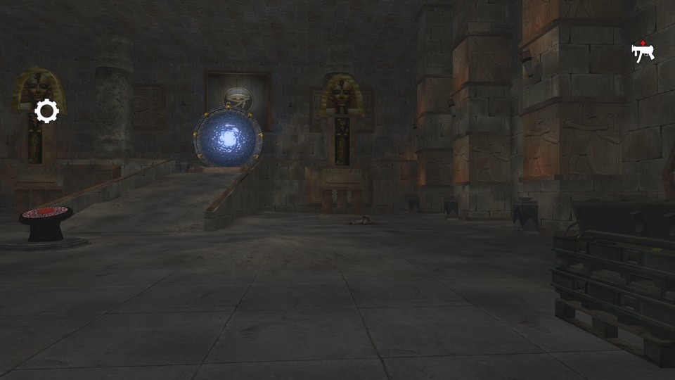

# Abydos

The map was inspired by Stargate SG-1 and planet Abydos. Map has Stargate-style teleporters.

 - **name**: mp_xtr_abydos
 - **author**: jerkan
 - **email**: jerkan@net.hr
 - **web**: https://jerkanmaps.weebly.com/rotu-maps.html

**Works\***: Yes
 
\* *'Works' here just means it passed my basic checks.  It does not mean it doesn't have bugs or is a good map; just that it appears to function as a RotU map.*

**Blacklisted\***: False
 
\* *'Blacklisted' means the map is, or will be after I exhaust efforts to fix it, blacklisted by RotU, and the mod will refuse to load the map. This helps minimize server crashes, and people trying unsuitable maps.*

## Notes


## Tested Version

These test results apply to the files with the MD5 hashes below. There may be multiple versions of map out there
with the same name but different data.

```
3168d539f5cff69f113c7b21ffce5b7a mp_xtr_abydos.ff
ac8c56fadc93c9d2ae1277e0893ee5d2 mp_xtr_abydos_load.ff
8632478bc761b514b6725247bbe91e6f mp_xtr_abydos.iwd
```

## Test Results

 - **RotU git revision**: 07c4093
 - **test timestamp**: 2026-05-16 19:36:50 CDT (UTC-5)
 - **platform**: Linux Kubuntu 25.10 | CoD4 1.7 original 1080p | Wine v.10.0, @ 192 DPI | AMD Radeon 680M 4GiB, 4K Display
 - **map started**: True
 - **player spawned**: True
 - **zombie spawned & stalked player**: True
 - **waypoint validity**: Valid
 - **weapon shops**: 9
 - **equipment shops**: 7
 - **waypoint count**: 155
 - **waypoints type**: internal
 - **compile error count**: 0
 - **runtime error count**: 0
 - **overall success**: True