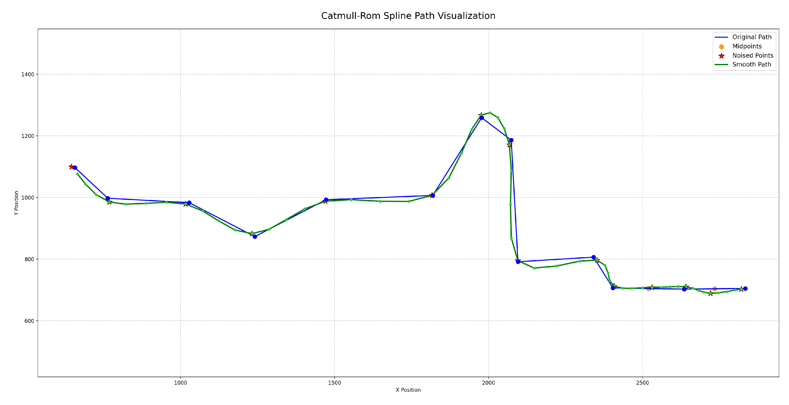

# Catmull-Rom Spline Smoothing

The above chart is real path data from a 'real' zombie.  All the main math is done, but nothing is integrated with the zombies yet.

In this case, the path starts on the right.  The blue dots are our waypoints, and the blue lines are the waypoint links.  These are the paths zombies follow in RotU 2.x.  This path has 13 nodes, which is atypical.  We normally only return 8 nodes, and often it only takes 2-4 nodes for a zombie to reach its destination or otherwise need a new path.

Catmull-Rom requires at least 4 nodes, which we can fudge a bit at the beginning & the end. We interpolate a new point between each of the first two waypoints--the midpoints of the path bewteen the nodes; thereby permitting smoother paths with only 2 real nodes.  These are the orange points on chart.

We also add a small amount of pseudo-random noice to each position.  These are the red stars.  This ensures that no two zombie paths are likely to be the same, thus the zombies will be slightly harder to shoot.

The green dots and green lines are the Catmull-Rom smoothed path.  Note the line smoothly passes through each red star.  If we didn't add noise, they'd pass through each orange and blue dot.

Once this smoothing is implemented into the zombie movement logic, our zombies will no longer make harsh military turns.